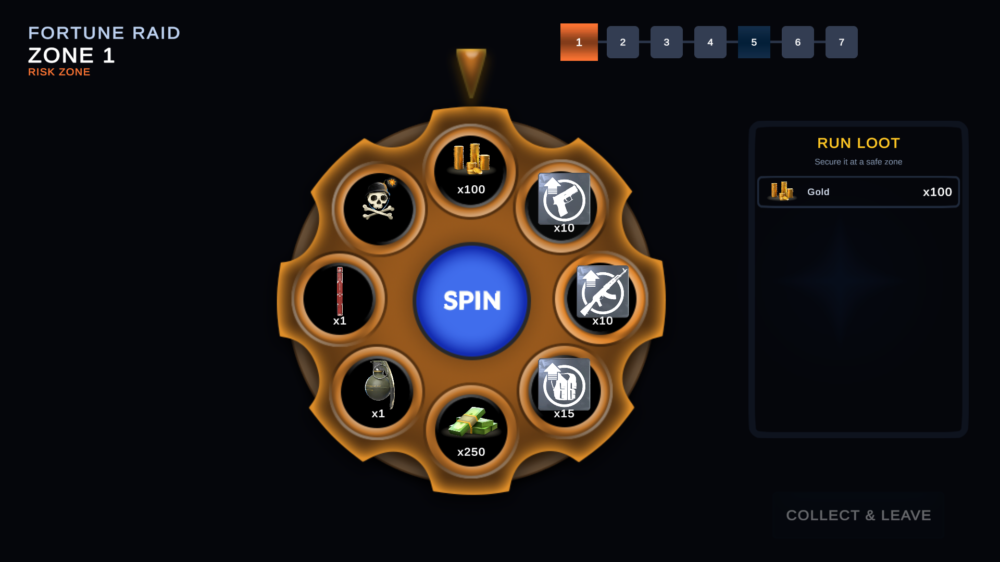
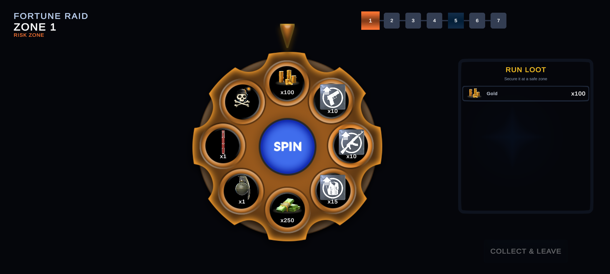
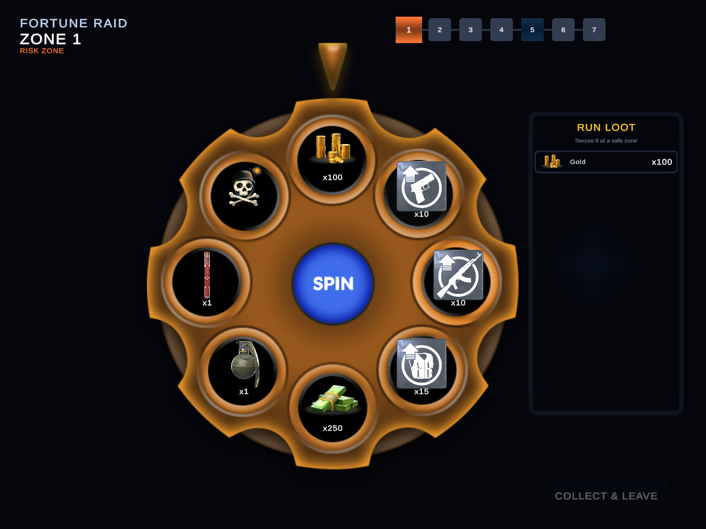

# Vertigo Wheel Demo (Fortune Raid)

Mobile risk-and-reward wheel demo for Unity **2021.3.45f2 LTS**.

## Preview

Gameplay video: [Delivery/Video/fortune_raid_demo.mp4](Delivery/Video/fortune_raid_demo.mp4)

## Open and play

1. Install Unity 2021.3.45f2 with Android Build Support (SDK/NDK) and OpenJDK if you need APK builds.
2. Open this folder in Unity Hub.
3. Open `Assets/VertigoDemo/Fortune Raid/Scenes/Game.unity` and press Play.

`GameRoot` starts the run and wires the screen, popup service, localization, feedback, and rules. UI strings live in `LocalizationKeys` (default language: **English**). Wheel / reward content is authored as ScriptableObjects under `Assets/VertigoDemo/Fortune Raid/Data`.

## Gameplay

- Normal zones contain seven rewards and one bomb.
- Every fifth zone is a bomb-free silver Safe Zone.
- Every thirtieth zone overrides the Safe Zone rule with a bomb-free Golden Zone.
- Golden pools rotate between seasonal gear, consumables, weapon renders, alternative point rewards, and chest tiers.
- Unique cosmetics, weapon skins/renders, and chests award one copy and do not stack within a run. Duplicate unique hits show an "already owned" popup, then advance.
- Special rewards use the supplied offer-shine and star-glow sprites in both the wheel slot and result popup.
- Golden Zones communicate `SPECIAL REWARDS. NO BOMB.` before interaction unlocks.
- Stackable rewards scale with the current zone; unique rewards remain at one copy.
- Gold collected from the wheel credits the revive currency wallet (loot gold stays in sync with spend).
- Each run allows one currency revive and one rewarded-ad revive; after both are used only Give Up remains.
- Give up discards the run loot.
- Leaving is enabled only while idle in Safe and Golden Zones; on Risk Zones the leave control is dimmed and non-interactable.
- Mock rewarded ads use the in-prefab mock ad overlay (`MockAdView` / `IRewardedAdService`).

## Delivery package

| Artifact | Path |
|----------|------|
| Screenshots 16:9 / 20:9 / 4:3 | [Delivery/Screenshots/](Delivery/Screenshots/) |
| Gameplay video | [Delivery/Video/fortune_raid_demo.mp4](Delivery/Video/fortune_raid_demo.mp4) |
| Android APK | `Delivery/Builds/FortuneRaid.apk` (local / release asset; `*.apk` is gitignored) |

### Editor helpers

- `Vertigo Demo > Capture Delivery Screenshots`
- `Vertigo Demo > Build Windows Player`
- `Vertigo Demo > Build Android APK` (requires JDK 11 + Unity Android SDK/NDK)

## AI usage

AI was used as a design and documentation partner in two areas:

1. **README creation** — organizing setup, gameplay rules, architecture notes, and delivery references into a reviewer-friendly document.
2. **UX Strategy Ideas** — suggesting and evaluating interaction flow, reward communication, safe/super-zone readability, bomb feedback, popup sequencing, responsive composition, and visual-polish opportunities.

The final Unity implementation, assets, prefabs, ScriptableObject data, and runtime behavior were reviewed and integrated in the project codebase.
